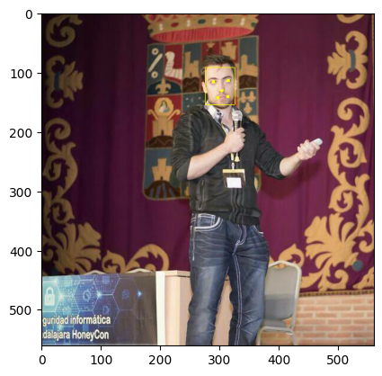

## Usage Guide for MTCNN

This guide demonstrates how to use the MTCNN package for face detection and facial landmark recognition, along with image plotting for visualization. In this example, we will:

- Load an image.
- Detect faces and landmarks using the MTCNN detector.
- Plot the results, including bounding boxes and facial landmarks.

### 1. Importing Required Modules

To begin, we need to import the MTCNN detector, image loading utility, and plotting functionality:

```python
from mtcnn import MTCNN
from mtcnn.utils.images import load_image
from mtcnn.utils.plotting import plot
import matplotlib.pyplot as plt
```

### 2. Loading an Image

We load an image from a file using the `load_image` utility function. In this example, the image is located in the `resources` directory:

```python
image = load_image("../resources/ivan.jpg")
```

This will load the image as a tensor, ready to be processed by the MTCNN detector.

### 3. Initializing the MTCNN Detector

Next, we initialize the MTCNN detector. You can specify the device where the models should be loaded. In this case, we are loading the models on the CPU:

```python
mtcnn = MTCNN(device="CPU:0")
```

### 4. Detecting Faces

Once the image is loaded and the detector is initialized, we can detect faces in the image. The `detect_faces` method returns a list of dictionaries, each containing the bounding box, facial landmarks, and confidence score for each detected face.

```python
result = mtcnn.detect_faces(image)
```

The `result` will contain the bounding box and facial landmarks for each detected face, similar to the following format:

```json
[
    {
        "box": [277, 90, 48, 63],
        "keypoints": {
            "nose": [303, 131],
            "mouth_right": [313, 141],
            "right_eye": [314, 114],
            "left_eye": [291, 117],
            "mouth_left": [296, 143]
        },
        "confidence": 0.9985
    }
]
```

### 5. Plotting the Results

To visualize the results, including the bounding boxes and facial landmarks, we can use the `plot` function from `mtcnn.utils.plotting`, which overlays the detection results on the original image. We then display the image using `matplotlib`:

```python
plt.imshow(plot(image, result))
plt.show()
```

This will display the image with the detected faces, drawing bounding boxes and marking the facial landmarks.

### Full Example Code

Here’s the full code for loading an image, detecting faces, and plotting the results:

```python
from mtcnn import MTCNN
from mtcnn.utils.images import load_image
from mtcnn.utils.plotting import plot
import matplotlib.pyplot as plt

# Load the image
image = load_image("../resources/ivan.jpg")

# Initialize MTCNN detector
mtcnn = MTCNN(device="CPU:0")

# Detect faces and landmarks
result = mtcnn.detect_faces(image, threshold_onet=0.85)

# Plot the results
plt.imshow(plot(image, result))
plt.show()
```



### Conclusion

In this example, we have successfully loaded an image, detected faces and their landmarks using MTCNN, and visualized the results with bounding boxes and keypoints. MTCNN provides a simple and efficient interface for multitask face detection and alignment, with easy-to-use utilities for image processing and result visualization.

For further customization, you can explore additional options such as adjusting detection thresholds or using different devices (e.g., GPU) for faster processing.
