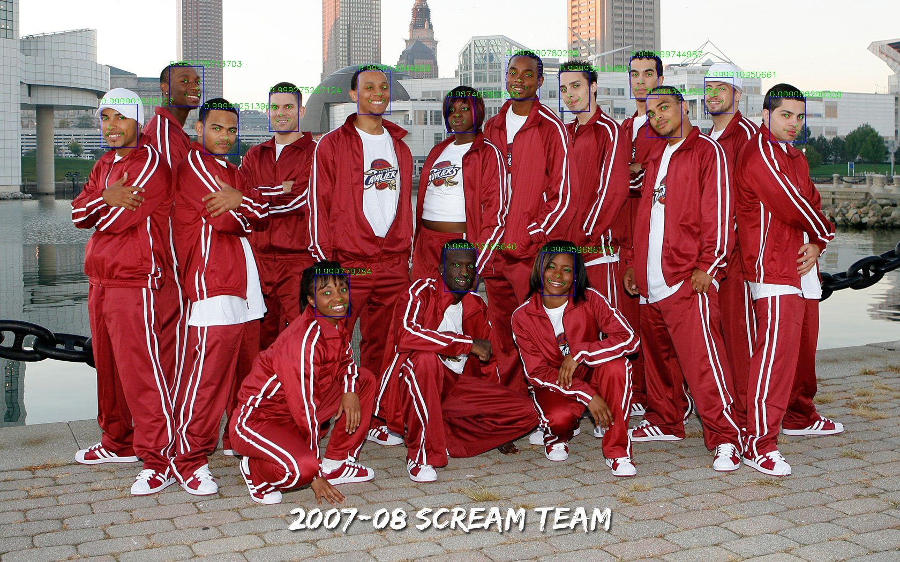

## MTCNN-tf 
**This is a tensorflow implementation of MTCNN for both training and testing.**

### Requirement
0. Ubuntu 14.04 or 16.04 or Mac 10.*
1. tensorflow 1.3 && python3.6: [https://github.com/tensorflow/tensorflow](https://github.com/tensorflow/tensorflow)
2. opencv 3.0 for python3.6 
`pip install opencv-python`
3. numpy 1.13
`pip install numpy`

### Prepare Data
***notice: You should be at `ROOT_DIR/prepare_data/` if you want to run the following command.***

- **Step1**. Download Wider Face Training part only from [Official Website](http://mmlab.ie.cuhk.edu.hk/projects/WIDERFace/) and unzip to replace `WIDER_train`

- **Step2**. Run `python gen_shuffle_data.py 12` to generate 12net training data. Besides, `python gen_tfdata_12net.py` provide you an example to build tfrecords file. Remember changing and adding necessary params.

- **Step3**. Run `python tf_gen_12net_hard_example.py` to generate hard sample. Run `python gen_shuffle_data.py 24` to generate random cropped training data. Then run `python gen_tfdata_24net.py ` to combine these output and generate tfrecords file.

- **Step4**. Similar to last step. Run `python gen_24net_hard_example.py` to generate hard sample. Run `python gen_shuffle_data.py 48` to generate random cropped training data. Then run `python gen_tfdata_48net.py ` to combine these output and generate tfrecords file.

### Training Example
***notice: You should be at `ROOT_DIR/` if you want to run the following command.***

if you have finished step 2 above, you can run `python src/mtcnn_pnet_test.py` to do Pnet training.
Similarly, after step 3 or step 4, you can run `python src/mtcnn_rnet_test.py` or `python src/mtcnn_onet_test.py` to train Rnet and Onet respectively.

### Testing Example
***notice: You should be at `ROOT_DIR/` if you want to run the following command.***

You can run `python test_img.py YOUR_IMAGE_PATH --model_dir ./save_model/all_in_one/` to test mtcnn with the provided model. 
You can also provide your own training model directory to do the test. If there are multiple models in the directory, the program will automatically choose the model with the maximum iterations.
### Results

### Reference
[1] MTCNN paper link: [Joint Face Detection and Alignment using Multi-task Cascaded Convolutional Networks](https://arxiv.org/pdf/1604.02878v1.pdf)

[2] MTCNN official code: [MTCNN with Caffe](https://github.com/Seanlinx/mtcnn)
